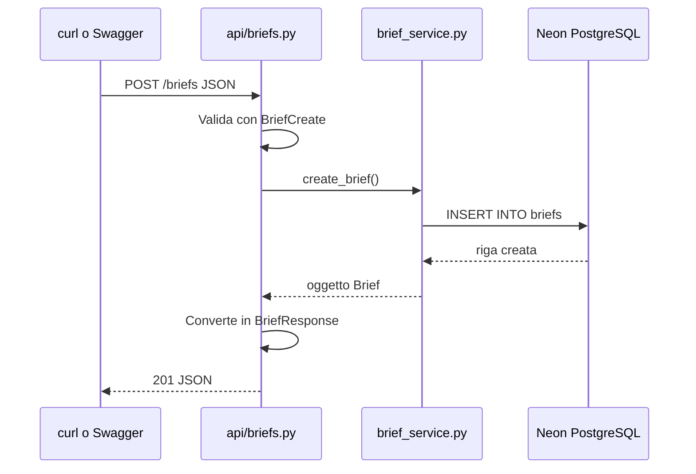

# Fase 3 — CRUD `/briefs` (REST API completa)

## Obiettivo

Esporre gli endpoint REST per creare, leggere, aggiornare ed eliminare i brief su Neon. Al termine potrai gestire i brief via API (curl, Swagger o frontend futuro).

**Tu crei tutti i file e modifichi `main.py`.** Questo documento ti guida passo passo.

**Prerequisito:** Fase 2 completata (`GET /health` con `"database": "connected"`).

---

## Teoria — Cos'e il CRUD

CRUD = **C**reate, **R**ead, **U**pdate, **D**elete. Sono le 4 operazioni base su qualsiasi risorsa.

| Operazione | HTTP | Endpoint | Cosa fa |
|------------|------|----------|---------|
| Read (lista) | GET | `/briefs` | Restituisce tutti i brief |
| Read (uno) | GET | `/briefs/{id}` | Restituisce un brief per ID |
| Create | POST | `/briefs` | Crea un nuovo brief |
| Update | PUT | `/briefs/{id}` | Aggiorna un brief esistente |
| Delete | DELETE | `/briefs/{id}` | Elimina un brief |

---

## Teoria — Layering (architettura a strati)

In un'app moderna non metti tutta la logica in `main.py`. Separare i layer rende il codice testabile e leggibile:

```
Richiesta HTTP
    ↓
api/briefs.py        → riceve la richiesta, valida input, restituisce HTTP status
    ↓
services/brief_service.py  → logica business (query DB, commit)
    ↓
models/brief.py      → mappa tabella PostgreSQL
    ↓
Neon PostgreSQL
```

| Layer | Responsabilita |
|-------|----------------|
| `schemas/` | Validazione input/output API (Pydantic) |
| `api/` | Route HTTP, status code, errori 404 |
| `services/` | Logica applicativa e accesso DB |
| `models/` | Struttura tabella SQLAlchemy |

**Regola:** il modello SQLAlchemy (`Brief`) non esce mai direttamente dall'API. Usi sempre uno schema Pydantic (`BriefResponse`) per la risposta.

---

## Teoria — Pydantic vs SQLAlchemy (recap)

| | SQLAlchemy `Brief` | Pydantic `BriefCreate` / `BriefResponse` |
|--|-------------------|------------------------------------------|
| Scopo | Parla con PostgreSQL | Valida JSON in entrata/uscita |
| Quando | Query, insert, update | Request body, response JSON |
| Esempio | `db.query(Brief).all()` | `BriefCreate(title="...", ...)` |

In Fase 3 crei **3 schemi**:
- `BriefCreate` — dati per POST (senza id, senza status)
- `BriefUpdate` — dati per PUT (tutti opzionali)
- `BriefResponse` — dati in risposta (con id, date, status)

---

## Struttura file da creare o modificare

```
backend/app/
├── main.py                    (modifica)
├── api/
│   ├── __init__.py            (nuovo, vuoto)
│   └── briefs.py              (nuovo)
├── schemas/
│   ├── __init__.py            (nuovo, vuoto)
│   └── brief_schema.py        (nuovo)
└── services/
    ├── __init__.py            (nuovo, vuoto)
    └── brief_service.py       (nuovo)
```

---

## Passo 1 — Crea `app/schemas/brief_schema.py`

```python
from datetime import datetime
from enum import Enum
from uuid import UUID

from pydantic import BaseModel, ConfigDict, Field


class SourceType(str, Enum):
    LINKEDIN_JOB = "LinkedIn Job"
    UPWORK_JOB = "Upwork Job"
    CLIENT_EMAIL = "Client Email"
    TENDER_RFP = "Tender / RFP"
    INTERNAL_PROJECT = "Internal Project"
    OTHER = "Other"


class BriefStatus(str, Enum):
    NEW = "New"
    ANALYSED = "Analysed"
    PROPOSAL_DRAFTED = "Proposal Drafted"
    ARCHIVED = "Archived"


class BriefCreate(BaseModel):
    title: str = Field(min_length=1, max_length=255)
    client_name: str | None = None
    source_type: SourceType
    brief_text: str = Field(min_length=1)


class BriefUpdate(BaseModel):
    title: str | None = Field(default=None, min_length=1, max_length=255)
    client_name: str | None = None
    source_type: SourceType | None = None
    brief_text: str | None = Field(default=None, min_length=1)
    status: BriefStatus | None = None
    risk_level: str | None = None
    complexity: str | None = None
    estimated_effort: str | None = None


class BriefResponse(BaseModel):
    model_config = ConfigDict(from_attributes=True)

    id: UUID
    title: str
    client_name: str | None
    source_type: str
    brief_text: str
    status: str
    risk_level: str | None
    complexity: str | None
    estimated_effort: str | None
    created_at: datetime
    updated_at: datetime
```

**Cosa fa:**
- `SourceType` e `BriefStatus` — enum allineati al PDF del progetto
- `BriefCreate` — solo i campi che l'utente invia alla creazione
- `BriefUpdate` — tutti opzionali (PUT parziale)
- `BriefResponse` — `from_attributes=True` converte oggetto SQLAlchemy in JSON

---

## Passo 2 — Crea `app/services/brief_service.py`

```python
from uuid import UUID

from sqlalchemy.orm import Session

from app.models.brief import Brief
from app.schemas.brief_schema import BriefCreate, BriefUpdate


def list_briefs(db: Session) -> list[Brief]:
    return db.query(Brief).order_by(Brief.created_at.desc()).all()


def get_brief(db: Session, brief_id: UUID) -> Brief | None:
    return db.query(Brief).filter(Brief.id == brief_id).first()


def create_brief(db: Session, data: BriefCreate) -> Brief:
    brief = Brief(
        title=data.title,
        client_name=data.client_name,
        source_type=data.source_type.value,
        brief_text=data.brief_text,
        status="New",
    )
    db.add(brief)
    db.commit()
    db.refresh(brief)
    return brief


def update_brief(db: Session, brief: Brief, data: BriefUpdate) -> Brief:
    update_data = data.model_dump(exclude_unset=True)

    if "source_type" in update_data and update_data["source_type"] is not None:
        update_data["source_type"] = update_data["source_type"].value

    if "status" in update_data and update_data["status"] is not None:
        update_data["status"] = update_data["status"].value

    for field, value in update_data.items():
        setattr(brief, field, value)

    db.commit()
    db.refresh(brief)
    return brief


def delete_brief(db: Session, brief: Brief) -> None:
    db.delete(brief)
    db.commit()
```

**Cosa fa:**
- `list_briefs` — SELECT ordinato per data
- `create_brief` — INSERT con status `"New"` di default
- `update_brief` — aggiorna solo i campi inviati (`exclude_unset=True`)
- `delete_brief` — DELETE (su Neon cascadera anche analysis/proposal se esistono)

---

## Passo 3 — Crea `app/api/briefs.py`

```python
from uuid import UUID

from fastapi import APIRouter, Depends, HTTPException
from sqlalchemy.orm import Session

from app.db.database import get_db
from app.schemas.brief_schema import BriefCreate, BriefResponse, BriefUpdate
from app.services import brief_service

router = APIRouter(prefix="/briefs", tags=["briefs"])


@router.get("", response_model=list[BriefResponse])
def list_briefs(db: Session = Depends(get_db)):
    return brief_service.list_briefs(db)


@router.post("", response_model=BriefResponse, status_code=201)
def create_brief(data: BriefCreate, db: Session = Depends(get_db)):
    return brief_service.create_brief(db, data)


@router.get("/{brief_id}", response_model=BriefResponse)
def get_brief(brief_id: UUID, db: Session = Depends(get_db)):
    brief = brief_service.get_brief(db, brief_id)
    if not brief:
        raise HTTPException(status_code=404, detail="Brief not found")
    return brief


@router.put("/{brief_id}", response_model=BriefResponse)
def update_brief(brief_id: UUID, data: BriefUpdate, db: Session = Depends(get_db)):
    brief = brief_service.get_brief(db, brief_id)
    if not brief:
        raise HTTPException(status_code=404, detail="Brief not found")
    return brief_service.update_brief(db, brief, data)


@router.delete("/{brief_id}", status_code=204)
def delete_brief(brief_id: UUID, db: Session = Depends(get_db)):
    brief = brief_service.get_brief(db, brief_id)
    if not brief:
        raise HTTPException(status_code=404, detail="Brief not found")
    brief_service.delete_brief(db, brief)
```

**Cosa fa:**
- `APIRouter` — raggruppa le route sotto `/briefs`
- `Depends(get_db)` — FastAPI inietta la sessione DB automaticamente
- `404` — se l'ID non esiste
- `201` — codice HTTP standard per risorsa creata
- `204` — DELETE senza body in risposta

---

## Passo 4 — Crea i file `__init__.py` vuoti

Crea questi file vuoti (servono a Python):

- `app/api/__init__.py`
- `app/schemas/__init__.py`
- `app/services/__init__.py`

---

## Passo 5 — Modifica `app/main.py`

Sostituisci il contenuto di `main.py` con:

```python
from fastapi import FastAPI, HTTPException

from app.api.briefs import router as briefs_router
from app.db.database import check_database_connection

app = FastAPI(title="BriefScope AI", version="0.1.0")

app.include_router(briefs_router)


@app.get("/health")
def health():
    try:
        check_database_connection()
        return {"status": "ok", "database": "connected"}
    except Exception:
        raise HTTPException(status_code=503, detail="Database connection failed")
```

**Cosa cambia:** `app.include_router(briefs_router)` registra tutte le route `/briefs`.

---

## Passo 6 — Riavvia il server

Se uvicorn gira con `--reload`, si riavvia da solo. Altrimenti:

```bash
cd /Users/vincenzo/Desktop/websites/briefscope-ai/backend
source .venv/bin/activate
uvicorn app.main:app --reload --port 8000
```

---

## Passo 7 — Verifica con Swagger

Apri http://localhost:8000/docs

Dovresti vedere la sezione **briefs** con 5 endpoint. Prova da li:

1. **GET /briefs** — Execute → vedi i 3 brief di Fase 1
2. **POST /briefs** — usa questo body di esempio:

```json
{
  "title": "React Dashboard MVP",
  "client_name": "Beta Srl",
  "source_type": "Client Email",
  "brief_text": "Need a React dashboard with charts and user login."
}
```

3. **GET /briefs/{brief_id}** — copia un `id` dalla lista
4. **PUT /briefs/{brief_id}** — aggiorna solo lo status:

```json
{
  "status": "Archived"
}
```

5. **DELETE /briefs/{brief_id}** — elimina un brief di test (non uno dei 3 originali se vuoi tenerli)

---

## Passo 8 — Verifica con curl

**Lista brief:**

```bash
curl http://localhost:8000/briefs
```

**Crea brief:**

```bash
curl -X POST http://localhost:8000/briefs \
  -H "Content-Type: application/json" \
  -d '{
    "title": "API Integration Project",
    "client_name": "Gamma Ltd",
    "source_type": "Upwork Job",
    "brief_text": "Integrate Stripe and SendGrid into existing Python backend."
  }'
```

**Dettaglio (sostituisci UUID):**

```bash
curl http://localhost:8000/briefs/IL-TUO-UUID-QUI
```

**Aggiorna:**

```bash
curl -X PUT http://localhost:8000/briefs/IL-TUO-UUID-QUI \
  -H "Content-Type: application/json" \
  -d '{"complexity": "High"}'
```

**Elimina:**

```bash
curl -X DELETE http://localhost:8000/briefs/IL-TUO-UUID-QUI
```

---

## Passo 9 — Verifica su Neon

Nel SQL Editor di Neon:

```sql
SELECT id, title, client_name, status, created_at
FROM briefs
ORDER BY created_at DESC;
```

Devi vedere i brief creati via API oltre a quelli della Fase 1.

---

## Flusso completo (diagramma)



---

## Cosa impari in questa fase (per il CV)

- **REST API design**: metodi HTTP, status code 200/201/204/404
- **Layered architecture**: api / services / models / schemas
- **Pydantic validation**: enum, Field, `from_attributes`
- **FastAPI**: APIRouter, Depends, response_model
- **SQLAlchemy**: query, add, commit, refresh, delete
- **CRUD end-to-end**: API → Python → PostgreSQL → risposta JSON

---

## Mini-quiz CV

1. **Perche separare `BriefCreate` da `BriefResponse`?**
   L'input di creazione non include id, status o date generate dal sistema. La risposta include tutti i campi persistiti.

2. **Cosa fa `Depends(get_db)`?**
   FastAPI crea una sessione DB per ogni richiesta e la chiude automaticamente a fine richiesta.

3. **Perche il service layer e separato dall'API router?**
   La logica business e riusabile (CLI, test, job) senza dipendere da HTTP. L'API gestisce solo protocollo e status code.

---

## Checkpoint Fase 3

Segna completata la fase solo se tutti questi punti sono veri:

- [ ] File `schemas`, `services`, `api` creati
- [ ] `main.py` include il router
- [ ] `GET /briefs` restituisce JSON con i brief
- [ ] `POST /briefs` crea un brief (status 201)
- [ ] `GET /briefs/{id}` funziona con UUID valido
- [ ] `PUT /briefs/{id}` aggiorna almeno un campo
- [ ] `DELETE /briefs/{id}` elimina e restituisce 204
- [ ] `GET /briefs/{id}` con UUID inesistente restituisce 404
- [ ] I dati sono visibili anche nel SQL Editor di Neon

Quando hai finito, scrivi in chat: **"Fase 3 completata"**.

Passeremo alla **Fase 4**: `docs/phase-4-mock-analysis.md` — analisi AI finta senza LLM.

---

## Troubleshooting

| Errore | Causa probabile | Soluzione |
|--------|-----------------|-----------|
| `ModuleNotFoundError: app.services` | Manca `services/__init__.py` | Crea file vuoto |
| `422 Unprocessable Entity` su POST | JSON invalido o `source_type` sbagliato | Usa valori esatti enum (es. `"LinkedIn Job"`) |
| `500 Internal Server Error` su POST | Modello Brief senza default su date | Neon genera `created_at`; verifica connessione |
| Lista vuota `[]` | Nessun dato in DB | Esegui INSERT Fase 1 o POST /briefs |
| `404 Brief not found` | UUID errato | Copia id da GET /briefs |
| Enum non accettato | Typo in source_type | Valori ammessi: vedi `SourceType` in brief_schema.py |

---

## Valori ammessi per i campi enum

**source_type (POST):**
- `LinkedIn Job`
- `Upwork Job`
- `Client Email`
- `Tender / RFP`
- `Internal Project`
- `Other`

**status (PUT):**
- `New`
- `Analysed`
- `Proposal Drafted`
- `Archived`
