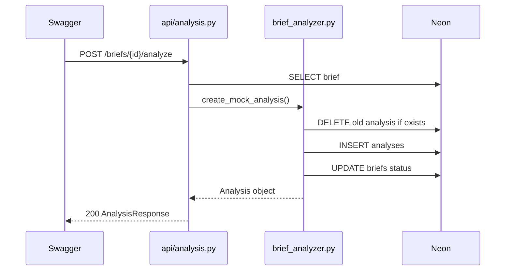

# Fase 4 — Analisi mock (senza LLM)

## Obiettivo

Aggiungere gli endpoint per analizzare un brief e salvare il risultato nella tabella `analyses` su Neon. In questa fase i dati sono **finti e statici** (mock): nessuna chiamata a OpenAI o altri LLM.

**Tu crei tutti i file e modifichi `main.py`.** Questo documento ti guida passo passo.

**Prerequisito:** Fase 3 completata (CRUD `/briefs` funzionante).

---

## Teoria — Perche il mock prima del LLM

L'analisi AI ha due parti distinte:

| Parte | Cosa fa | Fase |
|-------|---------|------|
| Pipeline dati | Salva analisi in PostgreSQL, aggiorna status brief | **Fase 4 (mock)** |
| Integrazione AI | Chiama LLM API e parsa JSON reale | Fase 5 |

Separarle ti permette di:
- capire il flusso HTTP → service → DB senza costi API
- debuggare errori SQL/Pydantic prima di aggiungere complessita
- avere un fallback di test anche senza chiave API

```
POST /briefs/{id}/analyze
    ↓
brief_analyzer.py  →  dati mock fissi
    ↓
INSERT in analyses + UPDATE brief (status, complexity, ...)
    ↓
GET /briefs/{id}/analysis  →  JSON salvato
```

---

## Teoria — Relazione brief ↔ analysis

- 1 brief puo avere **al massimo 1 analysis** (`brief_id UNIQUE` su Neon)
- Se analizzi di nuovo lo stesso brief, la analysis precedente viene **sostituita**
- Il brief passa da status `New` a `Analysed`
- Campi denormalizzati sul brief: `complexity`, `estimated_effort`, `risk_level`

---

## Endpoint (dal PDF)

| Metodo | URL | Azione |
|--------|-----|--------|
| POST | `/briefs/{brief_id}/analyze` | Crea/sostituisce analisi mock |
| GET | `/briefs/{brief_id}/analysis` | Legge analisi salvata |

---

## Struttura file da creare o modificare

```
backend/app/
├── main.py                         (modifica)
├── models/
│   └── analysis.py                 (nuovo)
├── schemas/
│   └── analysis_schema.py          (nuovo)
├── services/
│   └── brief_analyzer.py           (nuovo)
└── api/
    └── analysis.py                 (nuovo)
```

---

## Passo 1 — Crea `app/models/analysis.py`

```python
import uuid
from datetime import datetime

from sqlalchemy import DateTime, ForeignKey, String, Text, func
from sqlalchemy.dialects.postgresql import JSONB, UUID
from sqlalchemy.orm import Mapped, mapped_column, relationship

from app.db.database import Base


class Analysis(Base):
    __tablename__ = "analyses"

    id: Mapped[uuid.UUID] = mapped_column(UUID(as_uuid=True), primary_key=True, default=uuid.uuid4)
    brief_id: Mapped[uuid.UUID] = mapped_column(
        UUID(as_uuid=True), ForeignKey("briefs.id", ondelete="CASCADE"), unique=True, nullable=False
    )
    summary: Mapped[str | None] = mapped_column(Text)
    required_skills: Mapped[list] = mapped_column(JSONB, default=list)
    nice_to_have_skills: Mapped[list] = mapped_column(JSONB, default=list)
    technical_scope: Mapped[str | None] = mapped_column(Text)
    deliverables: Mapped[list] = mapped_column(JSONB, default=list)
    missing_information: Mapped[list] = mapped_column(JSONB, default=list)
    risks: Mapped[list] = mapped_column(JSONB, default=list)
    questions: Mapped[list] = mapped_column(JSONB, default=list)
    complexity: Mapped[str | None] = mapped_column(String(50))
    estimated_effort: Mapped[str | None] = mapped_column(String(100))
    suggested_daily_rate: Mapped[str | None] = mapped_column(String(100))
    implementation_plan: Mapped[str | None] = mapped_column(Text)
    created_at: Mapped[datetime] = mapped_column(DateTime(timezone=True), server_default=func.now())

    brief = relationship("Brief", backref="analysis", uselist=False)
```

**Nota:** `server_default=func.now()` su `created_at` evita lo stesso errore che avevi con i brief.

---

## Passo 2 — Crea `app/schemas/analysis_schema.py`

```python
from datetime import datetime
from uuid import UUID

from pydantic import BaseModel, ConfigDict


class AnalysisResponse(BaseModel):
    model_config = ConfigDict(from_attributes=True)

    id: UUID
    brief_id: UUID
    summary: str | None
    required_skills: list
    nice_to_have_skills: list
    technical_scope: str | None
    deliverables: list
    missing_information: list
    risks: list
    questions: list
    complexity: str | None
    estimated_effort: str | None
    suggested_daily_rate: str | None
    implementation_plan: str | None
    created_at: datetime
```

---

## Passo 3 — Crea `app/services/brief_analyzer.py`

```python
from uuid import UUID

from sqlalchemy.orm import Session

from app.models.analysis import Analysis
from app.models.brief import Brief


MOCK_ANALYSIS = {
    "summary": "The client needs a full-stack dashboard with AI-powered analysis.",
    "required_skills": ["React", "Python", "FastAPI", "PostgreSQL"],
    "nice_to_have_skills": ["Docker", "TypeScript"],
    "technical_scope": "Build a web dashboard with REST API backend and PostgreSQL storage.",
    "deliverables": ["Dashboard UI", "REST API", "Database schema"],
    "missing_information": ["Authentication requirements", "Deployment target"],
    "risks": ["Unclear authentication requirements", "No deployment strategy mentioned"],
    "questions": ["Which auth provider should be used?", "What is the expected timeline?"],
    "complexity": "Medium",
    "estimated_effort": "12-18 days",
    "suggested_daily_rate": "EUR 230-280/day",
    "implementation_plan": "1. Setup backend and DB\n2. Build CRUD APIs\n3. Integrate AI analysis\n4. Build frontend dashboard",
}


def get_analysis(db: Session, brief_id: UUID) -> Analysis | None:
    return db.query(Analysis).filter(Analysis.brief_id == brief_id).first()


def create_mock_analysis(db: Session, brief: Brief) -> Analysis:
    existing = get_analysis(db, brief.id)
    if existing:
        db.delete(existing)
        db.commit()

    analysis = Analysis(brief_id=brief.id, **MOCK_ANALYSIS)
    db.add(analysis)

    brief.status = "Analysed"
    brief.complexity = MOCK_ANALYSIS["complexity"]
    brief.estimated_effort = MOCK_ANALYSIS["estimated_effort"]
    brief.risk_level = "Medium"

    db.commit()
    db.refresh(analysis)
    return analysis
```

**Cosa fa:**
- `MOCK_ANALYSIS` — JSON statico identico all'esempio del PDF
- Se esiste gia un'analisi, la elimina e ne crea una nuova
- Aggiorna il brief collegato (status + campi riassuntivi)

---

## Passo 4 — Crea `app/api/analysis.py`

```python
from uuid import UUID

from fastapi import APIRouter, Depends, HTTPException
from sqlalchemy.orm import Session

from app.db.database import get_db
from app.schemas.analysis_schema import AnalysisResponse
from app.services import brief_service
from app.services.brief_analyzer import create_mock_analysis, get_analysis

router = APIRouter(prefix="/briefs", tags=["analysis"])


@router.post("/{brief_id}/analyze", response_model=AnalysisResponse)
def analyze_brief(brief_id: UUID, db: Session = Depends(get_db)):
    brief = brief_service.get_brief(db, brief_id)
    if not brief:
        raise HTTPException(status_code=404, detail="Brief not found")
    return create_mock_analysis(db, brief)


@router.get("/{brief_id}/analysis", response_model=AnalysisResponse)
def read_analysis(brief_id: UUID, db: Session = Depends(get_db)):
    brief = brief_service.get_brief(db, brief_id)
    if not brief:
        raise HTTPException(status_code=404, detail="Brief not found")

    analysis = get_analysis(db, brief_id)
    if not analysis:
        raise HTTPException(status_code=404, detail="Analysis not found")
    return analysis
```

---

## Passo 5 — Modifica `app/main.py`

Aggiungi l'import e il router:

```python
from fastapi import FastAPI, HTTPException

from app.api.analysis import router as analysis_router
from app.api.briefs import router as briefs_router
from app.db.database import check_database_connection

app = FastAPI(title="BriefScope AI", version="0.1.0")

app.include_router(briefs_router)
app.include_router(analysis_router)


@app.get("/health")
def health():
    try:
        check_database_connection()
        return {"status": "ok", "database": "connected"}
    except Exception:
        raise HTTPException(status_code=503, detail="Database connection failed")
```

**Ordine router:** entrambi usano prefix `/briefs`; FastAPI distingue le route per path completo (`/briefs`, `/briefs/{id}/analyze`, ecc.).

---

## Passo 6 — Riavvia e verifica su Swagger

Apri http://localhost:8000/docs

### Test 1 — Analizza un brief

1. **GET /briefs** — copia l'`id` di un brief con status `New`
2. **POST /briefs/{brief_id}/analyze** — Execute (nessun body richiesto)
3. Risposta attesa (200):

```json
{
  "id": "...",
  "brief_id": "...",
  "summary": "The client needs a full-stack dashboard with AI-powered analysis.",
  "required_skills": ["React", "Python", "FastAPI", "PostgreSQL"],
  "nice_to_have_skills": ["Docker", "TypeScript"],
  "technical_scope": "Build a web dashboard with REST API backend and PostgreSQL storage.",
  "deliverables": ["Dashboard UI", "REST API", "Database schema"],
  "missing_information": ["Authentication requirements", "Deployment target"],
  "risks": ["Unclear authentication requirements", "No deployment strategy mentioned"],
  "questions": ["Which auth provider should be used?", "What is the expected timeline?"],
  "complexity": "Medium",
  "estimated_effort": "12-18 days",
  "suggested_daily_rate": "EUR 230-280/day",
  "implementation_plan": "1. Setup backend and DB\n2. Build CRUD APIs\n3. Integrate AI analysis\n4. Build frontend dashboard",
  "created_at": "..."
}
```

### Test 2 — Leggi analisi

**GET /briefs/{brief_id}/analysis** — stesso JSON del passo prima.

### Test 3 — Brief aggiornato

**GET /briefs/{brief_id}** — verifica:

```json
{
  "status": "Analysed",
  "complexity": "Medium",
  "estimated_effort": "12-18 days",
  "risk_level": "Medium"
}
```

### Test 4 — Re-analisi

**POST /briefs/{brief_id}/analyze** di nuovo — sostituisce l'analisi esistente (stesso mock, nuovo `id` e `created_at`).

### Test 5 — Errori attesi

| Chiamata | Risultato |
|----------|-----------|
| POST con UUID inesistente | 404 Brief not found |
| GET /analysis su brief mai analizzato | 404 Analysis not found |

---

## Passo 7 — Verifica con curl

Sostituisci `BRIEF_ID` con un UUID reale:

```bash
curl -X POST http://localhost:8000/briefs/BRIEF_ID/analyze
```

```bash
curl http://localhost:8000/briefs/BRIEF_ID/analysis
```

```bash
curl http://localhost:8000/briefs/BRIEF_ID
```

---

## Passo 8 — Verifica su Neon

SQL Editor:

```sql
SELECT b.title, b.status, b.complexity, a.summary, a.estimated_effort
FROM briefs b
JOIN analyses a ON a.brief_id = b.id
ORDER BY a.created_at DESC;
```

Devi vedere almeno una riga con status `Analysed`.

```sql
SELECT required_skills, risks FROM analyses LIMIT 1;
```

I campi JSONB contengono array JSON.

---

## Flusso completo (diagramma)



---

## Cosa impari in questa fase (per il CV)

- **Relazioni 1:1** tra entita (brief ↔ analysis)
- **Upsert pattern** — sostituire risorsa collegata invece di duplicare
- **Denormalization** — copiare `complexity`/`effort` sul brief per la dashboard
- **JSONB in PostgreSQL** — array skills/risks come colonne native
- **Separazione concerns** — mock oggi, LLM in Fase 5 nello stesso service layer

---

## Mini-quiz CV

1. **Perche usiamo mock prima del LLM?**
   Isola problemi di persistenza e API dal debugging delle chiamate AI esterne.

2. **Perche `brief_id` e UNIQUE in `analyses`?**
   Garantisce una sola analisi per brief, coerente col dominio applicativo.

3. **Cosa succede se chiami analyze due volte sullo stesso brief?**
   La analysis precedente viene eliminata e ne viene creata una nuova; il brief resta `Analysed`.

---

## Checkpoint Fase 4

Segna completata la fase solo se tutti questi punti sono veri:

- [ ] Modello `Analysis`, schema, service e router creati
- [ ] `main.py` include `analysis_router`
- [ ] POST `/briefs/{id}/analyze` restituisce JSON mock completo
- [ ] GET `/briefs/{id}/analysis` restituisce la stessa analisi
- [ ] GET `/briefs/{id}` mostra `status: "Analysed"`
- [ ] JOIN su Neon mostra brief + analysis collegati
- [ ] 404 su brief o analysis inesistenti

Quando hai finito, scrivi in chat: **"Fase 4 completata"**.

Passeremo alla **Fase 5**: `docs/phase-5-llm-integration.md` — sostituire il mock con OpenAI/LLM reale.

---

## Troubleshooting

| Errore | Causa probabile | Soluzione |
|--------|-----------------|-----------|
| `404 Analysis not found` | Brief non ancora analizzato | Esegui POST analyze prima |
| `IntegrityError` su `created_at` | Manca `server_default` nel modello | Usa il modello del Passo 1 |
| `404 Brief not found` | UUID errato | Copia id da GET /briefs |
| Route non visibile in Swagger | Router non registrato in main.py | Verifica `include_router(analysis_router)` |
| `status` resta `New` | Commit non eseguito | Verifica `db.commit()` in brief_analyzer |
