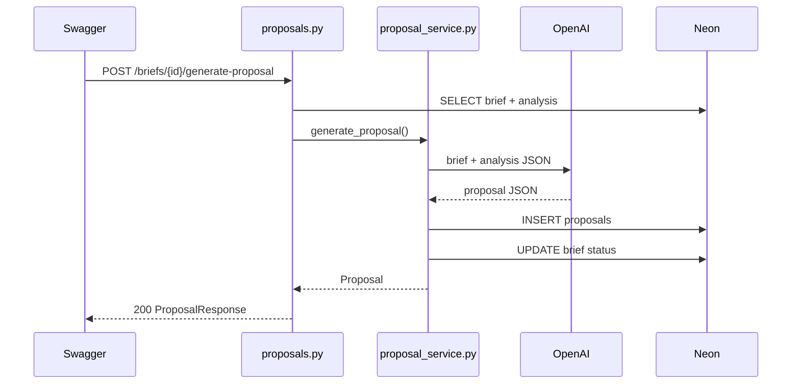

# Fase 6 — Proposal generator (LLM)

## Obiettivo

Dopo l'analisi di un brief, generare una **proposta commerciale** con LLM e salvarla in PostgreSQL. Espone due endpoint REST come nel PDF del progetto.

**Tu crei/modifichi i file indicati.** Questo documento ti guida passo passo.

**Prerequisito:** Fase 5 completata (`POST /briefs/{id}/analyze` con OpenAI funzionante).

---

## Teoria — Analisi vs Proposta

| | Analysis (Fase 5) | Proposal (Fase 6) |
|--|-------------------|-------------------|
| Scopo | Capire scope, rischi, skill | Scrivere testo da inviare al cliente |
| Input LLM | Solo `brief_text` | `brief_text` + dati analysis |
| Tabella | `analyses` | `proposals` |
| Status brief | `Analysed` | `Proposal Drafted` |

Flusso obbligatorio:

```
1. POST /briefs           → crea brief
2. POST /briefs/{id}/analyze   → analisi LLM
3. POST /briefs/{id}/generate-proposal  → proposta LLM
4. GET  /briefs/{id}/proposal  → legge proposta salvata
```

---

## Endpoint (dal PDF)

| Metodo | URL | Azione |
|--------|-----|--------|
| POST | `/briefs/{brief_id}/generate-proposal` | Genera e salva proposta |
| GET | `/briefs/{brief_id}/proposal` | Legge proposta salvata |

Output LLM (campi tabella `proposals`):

- `short_proposal` — email breve per il cliente
- `technical_proposal` — versione tecnica dettagliata
- `client_questions` — array di domande
- `next_step` — prossimo passo suggerito

---

## Struttura file da creare o modificare

```
backend/app/
├── main.py                         (modifica)
├── models/
│   └── proposal.py                 (nuovo)
├── schemas/
│   └── proposal_schema.py          (nuovo)
├── services/
│   ├── llm_service.py              (modifica — aggiungi funzione proposal)
│   └── proposal_service.py         (nuovo)
└── api/
    └── proposals.py                (nuovo)
```

---

## Passo 1 — Crea `app/models/proposal.py`

```python
import uuid
from datetime import datetime

from sqlalchemy import DateTime, ForeignKey, Text, func
from sqlalchemy.dialects.postgresql import JSONB, UUID
from sqlalchemy.orm import Mapped, mapped_column, relationship

from app.db.database import Base


class Proposal(Base):
    __tablename__ = "proposals"

    id: Mapped[uuid.UUID] = mapped_column(UUID(as_uuid=True), primary_key=True, default=uuid.uuid4)
    brief_id: Mapped[uuid.UUID] = mapped_column(
        UUID(as_uuid=True), ForeignKey("briefs.id", ondelete="CASCADE"), unique=True, nullable=False
    )
    short_proposal: Mapped[str | None] = mapped_column(Text)
    technical_proposal: Mapped[str | None] = mapped_column(Text)
    client_questions: Mapped[list] = mapped_column(JSONB, default=list)
    next_step: Mapped[str | None] = mapped_column(Text)
    created_at: Mapped[datetime] = mapped_column(DateTime(timezone=True), server_default=func.now())

    brief = relationship("Brief", backref="proposal", uselist=False)
```

---

## Passo 2 — Crea `app/schemas/proposal_schema.py`

```python
from datetime import datetime
from uuid import UUID

from pydantic import BaseModel, ConfigDict


class ProposalResponse(BaseModel):
    model_config = ConfigDict(from_attributes=True)

    id: UUID
    brief_id: UUID
    short_proposal: str | None
    technical_proposal: str | None
    client_questions: list
    next_step: str | None
    created_at: datetime
```

---

## Passo 3 — Aggiungi a `app/services/llm_service.py`

In coda al file esistente, aggiungi:

```python
PROPOSAL_SYSTEM_PROMPT = """You are a freelance proposal writer.
Based on the brief and its analysis, return ONLY valid JSON with exactly these fields:
- short_proposal (string, 2-4 paragraphs, professional tone for the client)
- technical_proposal (string, detailed technical approach)
- client_questions (array of strings, questions to clarify before starting)
- next_step (string, one clear call-to-action)

Write in the same language as the brief. Be specific to the project."""


def generate_proposal_with_llm(brief_text: str, analysis: dict) -> dict:
    if not settings.llm_api_key:
        raise ValueError("LLM_API_KEY is not configured")

    client = OpenAI(api_key=settings.llm_api_key)
    user_content = f"Brief:\n{brief_text}\n\nAnalysis:\n{json.dumps(analysis, ensure_ascii=False)}"
    response = client.chat.completions.create(
        model=settings.llm_model,
        response_format={"type": "json_object"},
        messages=[
            {"role": "system", "content": PROPOSAL_SYSTEM_PROMPT},
            {"role": "user", "content": user_content},
        ],
    )
    content = response.choices[0].message.content or "{}"
    return json.loads(content)
```

---

## Passo 4 — Crea `app/services/proposal_service.py`

```python
from uuid import UUID

from sqlalchemy.orm import Session

from app.models.brief import Brief
from app.models.proposal import Proposal
from app.services.brief_analyzer import get_analysis
from app.services.llm_service import generate_proposal_with_llm


def get_proposal(db: Session, brief_id: UUID) -> Proposal | None:
    return db.query(Proposal).filter(Proposal.brief_id == brief_id).first()


def generate_proposal(db: Session, brief: Brief) -> Proposal:
    analysis = get_analysis(db, brief.id)
    if not analysis:
        raise ValueError("Brief must be analysed before generating a proposal")

    analysis_dict = {
        "summary": analysis.summary,
        "required_skills": analysis.required_skills,
        "nice_to_have_skills": analysis.nice_to_have_skills,
        "technical_scope": analysis.technical_scope,
        "deliverables": analysis.deliverables,
        "risks": analysis.risks,
        "questions": analysis.questions,
        "complexity": analysis.complexity,
        "estimated_effort": analysis.estimated_effort,
        "suggested_daily_rate": analysis.suggested_daily_rate,
        "implementation_plan": analysis.implementation_plan,
    }

    proposal_data = generate_proposal_with_llm(brief.brief_text, analysis_dict)

    existing = get_proposal(db, brief.id)
    if existing:
        db.delete(existing)
        db.commit()

    proposal = Proposal(brief_id=brief.id, **proposal_data)
    db.add(proposal)

    brief.status = "Proposal Drafted"
    db.commit()
    db.refresh(proposal)
    return proposal
```

---

## Passo 5 — Crea `app/api/proposals.py`

```python
from uuid import UUID

from fastapi import APIRouter, Depends, HTTPException
from openai import APIError, AuthenticationError, RateLimitError
from sqlalchemy.orm import Session

from app.db.database import get_db
from app.schemas.proposal_schema import ProposalResponse
from app.services import brief_service
from app.services.proposal_service import generate_proposal, get_proposal

router = APIRouter(prefix="/briefs", tags=["proposals"])


@router.post("/{brief_id}/generate-proposal", response_model=ProposalResponse)
def generate_proposal_endpoint(brief_id: UUID, db: Session = Depends(get_db)):
    brief = brief_service.get_brief(db, brief_id)
    if not brief:
        raise HTTPException(status_code=404, detail="Brief not found")
    try:
        return generate_proposal(db, brief)
    except ValueError as e:
        raise HTTPException(status_code=400, detail=str(e))
    except AuthenticationError:
        raise HTTPException(status_code=401, detail="Invalid LLM_API_KEY")
    except RateLimitError:
        raise HTTPException(
            status_code=402,
            detail="OpenAI quota exceeded. Add billing credits at platform.openai.com",
        )
    except APIError as e:
        raise HTTPException(status_code=502, detail=e.message)
    except Exception as e:
        raise HTTPException(status_code=502, detail=str(e))


@router.get("/{brief_id}/proposal", response_model=ProposalResponse)
def read_proposal(brief_id: UUID, db: Session = Depends(get_db)):
    brief = brief_service.get_brief(db, brief_id)
    if not brief:
        raise HTTPException(status_code=404, detail="Brief not found")

    proposal = get_proposal(db, brief_id)
    if not proposal:
        raise HTTPException(status_code=404, detail="Proposal not found")
    return proposal
```

---

## Passo 6 — Modifica `app/main.py`

```python
from fastapi import FastAPI, HTTPException

from app.api.analysis import router as analysis_router
from app.api.briefs import router as briefs_router
from app.api.proposals import router as proposals_router
from app.db.database import check_database_connection

app = FastAPI(title="BriefScope AI", version="0.1.0")

app.include_router(briefs_router)
app.include_router(analysis_router)
app.include_router(proposals_router)


@app.get("/health")
def health():
    try:
        check_database_connection()
        return {"status": "ok", "database": "connected"}
    except Exception:
        raise HTTPException(status_code=503, detail="Database connection failed")
```

---

## Passo 7 — Test su Swagger

Flusso completo su un brief gia analizzato:

1. **POST /briefs/{id}/generate-proposal** — nessun body, attendi 5-15 secondi
2. Risposta attesa (200):

```json
{
  "id": "...",
  "brief_id": "...",
  "short_proposal": "Dear client, ...",
  "technical_proposal": "Architecture: ...",
  "client_questions": ["What auth provider?", "..."],
  "next_step": "Schedule a 30-minute call to confirm scope.",
  "created_at": "..."
}
```

3. **GET /briefs/{id}/proposal** — stesso JSON
4. **GET /briefs/{id}** — `"status": "Proposal Drafted"`

### Test errore atteso

POST generate-proposal su brief **senza** analisi prioritaria:

```json
{
  "detail": "Brief must be analysed before generating a proposal"
}
```

Status: **400**

---

## Passo 8 — Verifica su Neon

```sql
SELECT b.title, b.status, p.short_proposal, p.next_step
FROM briefs b
JOIN proposals p ON p.brief_id = b.id
ORDER BY p.created_at DESC;
```

---

## Flusso completo (diagramma)



---

## Cosa impari in questa fase (per il CV)

- **Multi-step AI pipeline** — output di un step come input del successivo
- **Business rules** — proposta solo se analisi esiste (400)
- **Content generation** — prompt diverso per analisi vs proposta
- **Status workflow** — `New` → `Analysed` → `Proposal Drafted`

---

## Mini-quiz CV

1. **Perche la proposta richiede l'analisi gia salvata?**
   Il LLM usa summary, risks e effort gia strutturati per generare testo coerente senza rianalizzare da zero.

2. **Perche `brief_id` e UNIQUE in `proposals`?**
   Un brief ha al massimo una proposta attiva, come per le analyses.

3. **Qual e la differenza tra short_proposal e technical_proposal?**
   Short = email commerciale per il cliente. Technical = approccio implementativo per decision maker tecnici.

---

## Checkpoint Fase 6

Segna completata la fase solo se:

- [ ] Modello `Proposal`, schema, service e router creati
- [ ] `llm_service.py` ha `generate_proposal_with_llm`
- [ ] `main.py` include `proposals_router`
- [ ] POST generate-proposal su brief analizzato restituisce proposta
- [ ] GET proposal restituisce la stessa proposta
- [ ] Brief passa a status `Proposal Drafted`
- [ ] POST su brief non analizzato restituisce 400
- [ ] Riga visibile in Neon tabella `proposals`

Quando hai finito, scrivi: **"Fase 6 completata"**.

Passeremo alla **Fase 7**: `docs/phase-7-qdrant-semantic-search.md` — embeddings e brief simili.

---

## Troubleshooting

| Errore | Causa | Soluzione |
|--------|-------|-----------|
| `400 Brief must be analysed` | Manca POST analyze | Analizza prima il brief |
| `404 Proposal not found` | Mai generata | Esegui POST generate-proposal |
| `402 quota exceeded` | Credito OpenAI | Ricarica billing |
| Proposta generica | Analysis debole | Usa brief piu dettagliato in analyze |
| `IntegrityError` su INSERT | Campi LLM mancanti | Verifica che LLM restituisca tutti e 4 i campi JSON |

---

## Costo aggiuntivo OpenAI

Ogni proposta = **1 chiamata LLM in piu** rispetto all'analisi (~$0.002-0.005 con gpt-4o-mini). Per 10 test completi (analyze + proposal) budget ~$0.05 totali.
